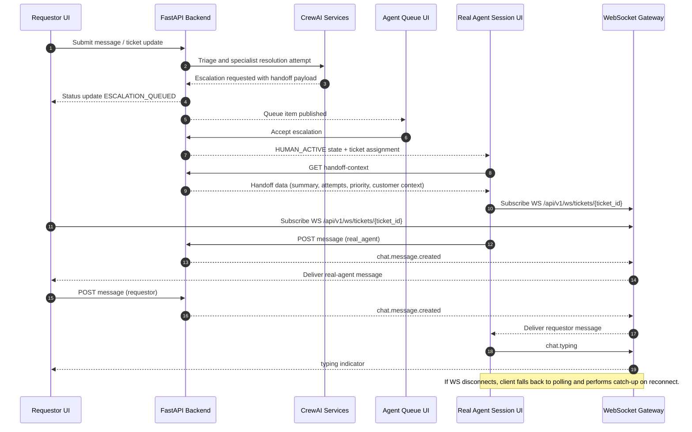

# System Architecture Document (SAD): Agentic Customer Support System

Project: Agentic Customer and IT Support System  
Version: 2.1  
Date: 2026-06-06  
Owner: System Architect  
Status: Build Phase (Phase 2) - Updated for Escalated Human Chat

---

## 0. Delta Summary (Review Guide)

This section highlights what changed from the prior Build SAD so reviewers can focus on implementation-impacting updates.

### 0.1 New

- Escalated human chat contract with explicit state model: OPEN, ESCALATION_REQUESTED, ESCALATION_QUEUED, HUMAN_ACTIVE, HUMAN_RESOLVED, CLOSED.
- Same-thread chat continuity requirement between requestor and REAL_AGENT after escalation acceptance.
- Real-time event contract for escalation and chat delivery, including fallback polling behavior.
- Data model extensions for live human chat: messages, escalation_sessions, ticket_participants.
- Engineer-focused implementation highlights for backend, frontend, and QA aligned to escalation delivery.

### 0.2 Changed

- Architectural framing now uses a template-aligned end-to-end structure for build execution (principles through launch strategy).
- Backend architecture emphasizes role authorization plus message-level authorization for ticket chat.
- Frontend architecture now requires sender_type-aware rendering, escalation system banners, and human presence indicators.
- QA scope now includes explicit acceptance criteria and regression coverage for human-escalated chat.
- DevOps and observability sections now include escalation SLA and first-human-response metrics.

### 0.3 Unchanged (Intent Preserved)

- Core multi-agent model (triage, specialist handling, human handoff) remains central.
- RBAC personas remain REQUESTOR, REAL_AGENT, PLATFORM_ADMIN.
- ServiceNow integration remains required; MVP defaults to mock mode with documented production migration path.
- Product intent remains hybrid AI plus human collaboration with context preservation and auditability.

---

## 1. MVP Architecture Philosophy and Principles

### 1.1 MVP Design Principles

- Customer feedback first: ship core support workflows and observe usage before expanding platform scope.
- Hybrid support by default: AI resolves most tickets, but real-agent escalation is first-class and not a fallback afterthought.
- Context never lost: escalation must preserve full conversation, classification, and attempted actions.
- Observable by default: every key user/agent transition emits auditable and testable events.
- Progressive hardening: MVP uses mocked identity and mock ServiceNow integration, with a documented migration path.

### 1.2 Core vs Future Decision Framework

Phase 2 MVP (in scope):
- Multi-role login with REQUESTOR, REAL_AGENT, PLATFORM_ADMIN.
- AI-led chat and ticket lifecycle.
- Escalated real-agent live chat on accepted escalations.
- ServiceNow mock integration for incident and KB operations.
- Role-based UI and role-based API authorization.

Deferred to future phases:
- SSO/SCIM integration.
- Omnichannel chat (email, voice, SMS).
- Advanced ABAC policies and policy engine.
- Multi-region active-active deployment.

### 1.3 Technical Architecture Decisions

| Decision | Choice | Rationale |
|---|---|---|
| Backend runtime | Python + FastAPI + CrewAI | Aligns with implemented codebase and CrewAI-native workflows |
| Frontend runtime | React 18 + Vite + Zustand | Fast iteration, existing team velocity, proven test setup |
| Ticket collaboration model | Shared conversation with role-aware messages | Enables seamless switch from AI to human without channel change |
| Escalation mode | Human joins same ticket chat after acceptance | Keeps customer in one thread and reduces resolution friction |
| ServiceNow for MVP | Mock-first via SERVICENOW_MOCK_ENABLED=true | Decouples external dependency risk during build and QA |

### 1.4 Audit

- AAMAD_ADAPTER: crewai
- LLM provider target: Azure Foundry (Azure OpenAI) via environment configuration
- MVP ServiceNow mode: mock enabled by default for local and QA runs

---

## 2. Multi-Agent System Specification

### 2.1 Agent Set (MVP)

1. Triage Agent
- Purpose: classify intent, urgency, and escalation need.
- Inputs: user message, ticket metadata, sentiment.
- Outputs: intent label, priority, routing decision.

2. Domain Specialist Agent
- Purpose: resolve order/product/returns/consumer/IT issues using tools and KB.
- Inputs: routed intent, conversation context, tool responses.
- Outputs: answer, next action, confidence score.

3. Handoff Agent
- Purpose: package context and create escalation payload.
- Inputs: conversation transcript, failed attempts, urgency.
- Outputs: escalation summary, assignment hints, ServiceNow incident payload.

4. Knowledge Agent
- Purpose: retrieve and synthesize KB evidence for responses and drafts.
- Inputs: user question, incident traits.
- Outputs: ranked KB evidence and draft article suggestions.

### 2.2 Collaboration Pattern

- Primary path: Triage -> Domain Specialist -> resolved.
- Escalation path: Triage/Domain Specialist -> Handoff Agent -> escalation queue -> REAL_AGENT accepts -> live human chat.
- Post-resolution path: resolved ticket -> Knowledge Agent draft generation.

### 2.3 Task Orchestration and Context Passing

- Each ticket maintains:
  - Conversation timeline.
  - Agent reasoning summary.
  - Tool call traces (redacted as needed).
  - Escalation package.
- On escalation acceptance, all prior context is injected into REAL_AGENT workspace before first human reply.

### 2.4 Escalated Human Chat Contract (New/Expanded)

Escalation state model:
- OPEN: AI working ticket.
- ESCALATION_REQUESTED: AI requested human handoff.
- ESCALATION_QUEUED: waiting for REAL_AGENT acceptance.
- HUMAN_ACTIVE: REAL_AGENT accepted and joined conversation.
- HUMAN_RESOLVED: human closed ticket with resolution note.
- CLOSED: final ticket closure.

Conversation ownership rules:
- In HUMAN_ACTIVE, AI auto-replies are disabled by default.
- AI can still provide private draft suggestions to REAL_AGENT.
- Requestor and REAL_AGENT exchange messages in the same conversation thread.

Service-level targets:
- Escalation acceptance target (P95): less than 3 minutes.
- First human reply after acceptance (P95): less than 90 seconds.

### 2.5 CrewAI Runtime Configuration

- Process type: sequential with controlled delegation.
- Retry policy: bounded retries for tool failures, then escalate.
- Caching: response and KB caching for repeat lookups.
- Logging: verbose for development, structured logs for production.

---

## 3. Frontend Architecture Specification

### 3.1 Stack and Structure

- React 18 + TypeScript + Vite.
- Zustand for auth/chat/ticket/ui state.
- Component domains:
  - ChatWidget for requestor live chat.
  - Agent workspace views for queue, context, and response controls.
  - Admin views for user/system management.

### 3.2 Role-Aware UX Requirements

REQUESTOR:
- Submit issue and continue chatting in one thread.
- See explicit escalation status and agent-joined indicator.
- Receive live updates when REAL_AGENT accepts.

REAL_AGENT:
- See escalation queue with SLA timers.
- Accept escalation and enter live chat console.
- View compiled AI summary, timeline, and tool outcomes.
- In the Real Agent conversation session page, always see handoff data (reason, summary, previous attempts, priority, and customer context) before sending replies.
- In the same Real Agent conversation session page, send and receive live chat messages with the requestor.

PLATFORM_ADMIN:
- Monitor escalation SLA, queue depth, and handoff outcomes.
- Configure routing thresholds and escalation policies.

### 3.3 Escalated Chat UI (New/Expanded)

Required interface changes:
- Shared message timeline must support sender_type: requestor, ai_agent, real_agent, system.
- Add system banners:
  - Escalation requested.
  - Agent accepted and joined.
  - Ticket resolved by human.
- Add typing and presence for REAL_AGENT in HUMAN_ACTIVE state.
- Keep composer active for requestor while queued and while human is active.
- Add a required Real Agent Conversation Session layout with two panes:
  - Handoff Data Pane: escalation reason, AI summary, attempted actions, ticket priority, customer history.
  - Live Chat Pane: full timeline plus composer for direct REAL_AGENT <-> requestor communication.

Frontend components requiring updates:
- ChatContainer, MessageList, MessageBubble, TypingIndicator.
- Agent page panels for queue and context.
- Ticket detail surfaces for escalation metadata.

### 3.4 Real-Time Transport

- Required for Real Agent conversation sessions: WebSocket channel per ticket as the primary real-time transport.
- Fallback: short polling where WebSocket not available.
- Event types:
  - escalation.requested
  - escalation.accepted
  - chat.message.created
  - chat.typing
  - ticket.status.changed

---

## 4. Backend Architecture Specification

### 4.1 API Architecture

Core role-aware APIs:
- POST /api/v1/tickets
- GET /api/v1/tickets/mine
- GET /api/v1/queue
- POST /api/v1/queue/{ticket_id}/accept
- POST /api/v1/queue/{ticket_id}/resolve
- POST /api/v1/tickets/{ticket_id}/escalate
- GET /api/v1/tickets/{ticket_id}/handoff-context
- GET /api/v1/tickets/{ticket_id}/messages
- POST /api/v1/tickets/{ticket_id}/messages
- WS /api/v1/ws/tickets/{ticket_id}

Authorization rules:
- REQUESTOR can access only own ticket messages.
- REAL_AGENT can access accepted/assigned queue tickets.
- PLATFORM_ADMIN can read all and configure policy endpoints.

### 4.2 Data Model Extensions for Human Chat

Required schema entities:
- messages
  - id, ticket_id, sender_id, sender_role, sender_type, body, created_at, metadata
- escalation_sessions
  - id, ticket_id, requested_at, accepted_at, accepted_by, queue_wait_seconds, status
- ticket_participants
  - ticket_id, user_id, role, joined_at, left_at

Behavioral constraints:
- Exactly one active human owner for HUMAN_ACTIVE at MVP.
- Message ordering guaranteed by created_at plus monotonic sequence.
- All state transitions audited.

### 4.3 CrewAI Integration Layer

- conversation_service orchestrates AI processing and transition to escalation.
- ticket_service owns queue operations and state transitions.
- servicenow_service handles mock/real ServiceNow switching.

ServiceNow mock controls:
- SERVICENOW_MOCK_ENABLED
- SERVICENOW_MOCK_HOST
- SERVICENOW_INSTANCE_URL (only when mock disabled)

Migration path (mock to production):
1. Keep payload contracts stable.
2. Introduce production credentials from secret manager.
3. Enable staged canary routing for incident creation.
4. Validate parity dashboards and error budgets.

### 4.4 Error Handling and Resilience

- If AI tool calls fail repeatedly, force escalation path.
- If no REAL_AGENT accepts within SLA threshold, notify admin and keep requestor informed.
- If WebSocket disconnects, persist messages and recover through polling.

### 4.5 API and WebSocket Contract (Real Agent Conversation Session)

The Real Agent conversation session requires both handoff-context retrieval and WebSocket-based live chat.

REST contract: handoff context

- Endpoint: GET /api/v1/tickets/{ticket_id}/handoff-context
- Purpose: populate handoff data pane before first REAL_AGENT reply.
- Access: REAL_AGENT for assigned/accepted tickets, PLATFORM_ADMIN read access.

Example response:

```json
{
  "ticket_id": "tkt_12345",
  "escalation": {
    "requested_at": "2026-06-06T12:01:00Z",
    "reason": "customer_requested_human",
    "priority": "high",
    "queue_wait_seconds": 42
  },
  "ai_summary": {
    "intent": "order_issue",
    "attempted_actions": [
      "order_lookup",
      "refund_policy_check"
    ],
    "resolution_attempts": 2,
    "last_ai_message": "I could not complete a refund due to policy mismatch."
  },
  "customer_context": {
    "user_id": "usr_1001",
    "open_ticket_count": 1,
    "recent_ticket_ids": ["tkt_12001", "tkt_12110"]
  }
}
```

REST contract: send message

- Endpoint: POST /api/v1/tickets/{ticket_id}/messages
- Purpose: server-authoritative message persistence and broadcast trigger.

Example request:

```json
{
  "sender_type": "real_agent",
  "body": "Hi, I am Alex from support. I reviewed your previous steps and can help now."
}
```

WebSocket contract: live conversation transport

- Endpoint: WS /api/v1/ws/tickets/{ticket_id}
- Purpose: primary low-latency channel for message, typing, and status events.
- Requirement: Real Agent conversation session page must subscribe immediately after escalation acceptance.

Client subscribe example:

```json
{
  "type": "subscribe",
  "ticket_id": "tkt_12345",
  "role": "REAL_AGENT"
}
```

Server event example:

```json
{
  "type": "chat.message.created",
  "ticket_id": "tkt_12345",
  "message": {
    "id": "msg_8001",
    "sender_type": "requestor",
    "body": "Thanks, I still need help with this order.",
    "created_at": "2026-06-06T12:03:44Z"
  }
}
```

Typing event example:

```json
{
  "type": "chat.typing",
  "ticket_id": "tkt_12345",
  "sender_type": "real_agent",
  "is_typing": true
}
```

Fallback behavior:

- On WebSocket failure, client switches to polling for messages and status.
- On reconnect, client performs catch-up fetch via GET /api/v1/tickets/{ticket_id}/messages.

---

## 5. DevOps and Deployment Architecture

### 5.1 Environments

- Local: mock ServiceNow, seeded test users, debug logging.
- QA: mock ServiceNow with latency/error injection enabled.
- Production: real ServiceNow endpoints, secrets manager, tightened rate limits.

### 5.2 CI/CD Requirements

- Backend tests gate merge.
- Frontend tests gate merge.
- Contract tests for escalation and chat event payloads.
- Smoke tests verify role login and escalation happy path post-deploy.

### 5.3 Monitoring and Alerts

Operational metrics:
- Escalation queue depth.
- Escalation acceptance latency.
- Human-chat session duration.
- Message delivery success rate.
- ServiceNow API error rate (mock and real).

Alert thresholds:
- Queue depth exceeds configured team capacity.
- Acceptance latency P95 breaches threshold.
- Role authorization failures spike.

---

## 6. Data Flow and Integration Architecture

### 6.1 End-to-End Request Flow

1. REQUESTOR creates or continues conversation.
2. AI agents triage and attempt resolution.
3. If escalation needed, system creates escalation package and queue item.
4. REAL_AGENT accepts escalation.
5. Conversation transitions to HUMAN_ACTIVE and both participants chat in same thread.
6. Resolution and close updates propagate to requestor and analytics.

### 6.1.1 Escalation to Real Agent Session Sequence



### 6.1.2 Implementation Checklist by Owner

BE:
- Implement and secure GET /api/v1/tickets/{ticket_id}/handoff-context for assigned REAL_AGENT and admin roles.
- Implement WS /api/v1/ws/tickets/{ticket_id} with role-aware subscription authorization.
- Persist outgoing/incoming messages before emitting chat.message.created events.
- Emit escalation.accepted, chat.message.created, and chat.typing events with ticket-scoped payloads.
- Support reconnect catch-up using GET /api/v1/tickets/{ticket_id}/messages with deterministic ordering.

FE:
- Build Real Agent conversation session layout with Handoff Data pane and Live Chat pane.
- Load and render handoff-context payload before enabling first human reply action.
- Connect to ticket WebSocket immediately on entering HUMAN_ACTIVE state.
- Render real-time message and typing events; switch to polling on transport failure.
- Reconcile optimistic message UI with server-confirmed events and message identifiers.

QA:
- Validate handoff data visibility before first REAL_AGENT reply in HUMAN_ACTIVE session.
- Validate real-time bidirectional messaging via WebSocket between requestor and REAL_AGENT.
- Validate reconnect behavior: disconnect WS, send new message, reconnect, verify catch-up.
- Validate role-based access denials for unauthorized ticket session subscriptions.
- Validate fallback polling path produces no duplicated or missing messages.

### 6.2 ServiceNow Integration Flow

- Incident creation on escalation and/or resolution, based on policy.
- KB retrieval for AI and human assist paths.
- Optional KB draft generation after resolved incidents.

### 6.3 Analytics and Feedback Flow

Tracked events:
- escalation_requested
- escalation_accepted
- first_human_reply
- human_resolved
- customer_feedback_submitted

These events feed dashboards for backend, frontend, and QA verification.

---

## 7. Performance and Scalability Specifications

### 7.1 Performance Targets

| Capability | Target |
|---|---|
| AI first response P95 | less than 30 seconds |
| Escalation queue enqueue | less than 2 seconds |
| First human reply after acceptance P95 | less than 90 seconds |
| Message publish-to-render P95 | less than 1 second |

### 7.2 Scalability Strategy

- Horizontal API scaling with stateless app instances.
- Redis-backed ephemeral session and presence state.
- Backpressure policies on chat events and queue processing.

### 7.3 Cost and Resource Controls

- AI token budget controls and fallback prompts.
- Real-time channel fanout limits per tenant/team.
- Archival of closed-ticket chat transcripts by retention policy.

---

## 8. Security and Compliance Architecture

### 8.1 Security Controls

- JWT-based authentication with role claims.
- Role checks at endpoint and business-service layers.
- Message-level authorization enforcement on every read/write.
- TLS in transit and encrypted storage at rest.

### 8.2 Compliance and Privacy

- PII redaction on logs and analytics events.
- Configurable retention and delete workflows.
- Audit logs for role changes, escalations, assignments, and closures.

### 8.3 Threats and Mitigations

- Unauthorized queue access: strict role scoping and server-side ownership validation.
- Transcript leakage: tenant/user filters and signed access tokens.
- Escalation spoofing: server-generated status transitions only.

---

## 9. Testing and Quality Assurance Specifications

### 9.1 Test Strategy

Backend:
- Unit tests for transition rules and authorization guards.
- Integration tests for escalation accept flow and message permissions.
- Contract tests for WebSocket events and REST payloads.

Frontend:
- Component tests for role-specific rendering and escalation banners.
- Interaction tests for live chat updates and typing indicators.
- E2E tests for requestor-to-agent escalation journey.

QA:
- Multi-role matrix covering access, function, and failure recovery.
- ServiceNow mock fault-injection scenarios.

### 9.2 Escalated Human Chat Acceptance Criteria (New/Expanded)

1. Requestor can request escalation and remain in same chat thread.
2. REAL_AGENT can accept from queue and immediately view full history and handoff data in the Real Agent conversation session page.
3. Requestor sees agent joined indicator and receives human responses live.
4. AI auto-response is paused when HUMAN_ACTIVE unless explicitly invoked by REAL_AGENT.
5. All escalation transitions are visible in audit logs.
6. Unauthorized users cannot read or send messages for unrelated tickets.
7. REAL_AGENT can send chat messages to requestor directly from the Real Agent conversation session page without switching screens.

### 9.3 Regression Coverage Focus

- Existing AI resolution paths remain functional.
- Ticket status and feedback flows remain intact.
- RBAC behavior remains consistent across UI and API.

---

## 10. MVP Launch and Feedback Strategy

### 10.1 Beta Rollout Plan

- Start with internal users and selected support agents.
- Enable escalation live chat for a controlled subset of queues.
- Compare AI-only vs AI+human escalation outcomes.

### 10.2 Success Metrics

- Escalation acceptance SLA adherence.
- Customer satisfaction delta for escalated tickets.
- Average resolution time delta between AI-only and escalated cases.
- Reopen rate for human-resolved escalated tickets.

### 10.3 Iteration Priorities After Build Validation

1. Improve agent assist tools for faster human responses.
2. Add supervisor monitoring for overloaded queues.
3. Expand integration hardening from mock to production ServiceNow.

---

## 11. PRD Traceability Matrix

| PRD Requirement | SAD Coverage |
|---|---|
| Autonomous resolution | Sections 2, 4, 7 |
| Human handoff with full context | Sections 2.4, 4.1, 6.1, 9.2 |
| ServiceNow incident and KB integration | Sections 4.3, 6.2 |
| Role-based access and personas | Sections 3.2, 4.1, 8.1 |
| Analytics and operational visibility | Sections 5.3, 6.3, 10.2 |

---

## 12. Engineering Implementation Highlights

### 12.1 Backend Engineer Highlights

- Implement escalation_sessions and messages persistence.
- Enforce HUMAN_ACTIVE ownership and sender authorization.
- Add WebSocket or equivalent event stream for ticket chat.
- Implement state machine guards for escalation transitions.
- Add structured events and metrics for escalation SLA.

### 12.2 Frontend Engineer Highlights

- Update chat UI to support mixed sender types and system events.
- Add queue-to-chat workflow for REAL_AGENT acceptance.
- Add requestor-visible escalation status and joined indicators.
- Ensure optimistic UI is reconciled with server-authoritative events.

### 12.3 QA Engineer Highlights

- Validate full requestor -> AI -> escalation -> human -> resolve path.
- Validate unauthorized message access denial across roles.
- Run latency/error injection tests in mock ServiceNow mode.
- Verify audit and analytics events for every transition.

---

Document Status: Updated and ready for implementation alignment across backend, frontend, and QA teams.